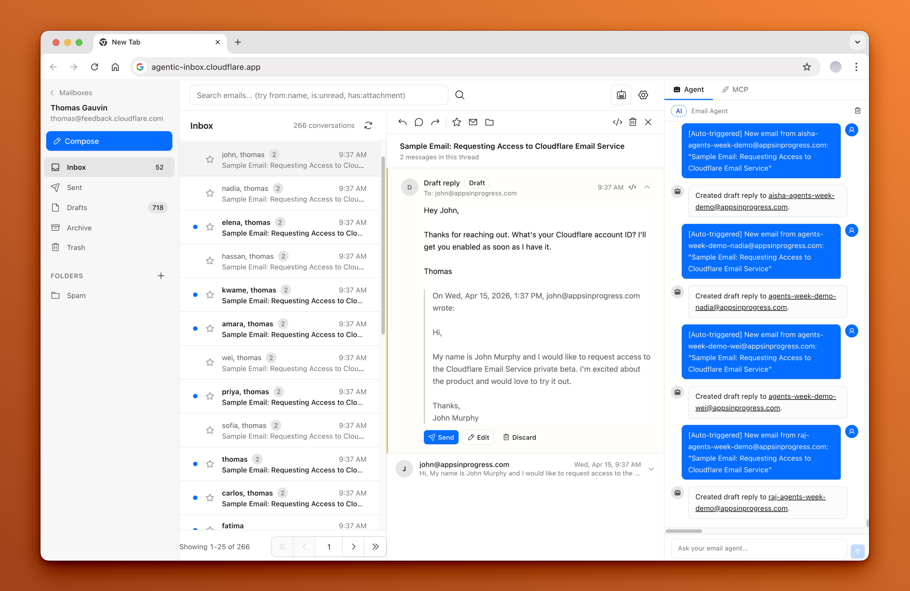

<div align="center">
  <h1>Agentic Inbox Codebam</h1>
  <p><em>A self-hosted email client with an AI agent, running entirely on Cloudflare Workers</em></p>
  <p>A modified fork of <a href="https://github.com/cloudflare/agentic-inbox">cloudflare/agentic-inbox</a></p>
</div>

> [!IMPORTANT]
> **This is an independent, modified fork of Cloudflare's Agentic Inbox. It is not affiliated with, endorsed by, or sponsored by Cloudflare, Inc.** The original project and this fork are licensed under the Apache License 2.0; see [LICENSE](LICENSE) and [NOTICE](NOTICE) for the retained copyright and attribution notices, and the git history for the complete list of changes.

Agentic Inbox Codebam lets you send, receive, and manage emails through a modern web interface -- all powered by your own Cloudflare account. Incoming emails arrive via [Cloudflare Email Routing](https://developers.cloudflare.com/email-routing/), each mailbox is isolated in its own [Durable Object](https://developers.cloudflare.com/durable-objects/) with a SQLite database, and attachments are stored in [R2](https://developers.cloudflare.com/r2/).

An **AI-powered Email Agent** can read your inbox, search conversations, and draft replies -- built with the [Cloudflare Agents SDK](https://developers.cloudflare.com/agents/) and [Workers AI](https://developers.cloudflare.com/workers-ai/).




Read the original Cloudflare blog post to learn more about Cloudflare Email Service and how to use it with the Agents SDK, MCP, and from the Wrangler CLI: [Email for Agents](https://blog.cloudflare.com/email-for-agents/).

## How to setup

**Important**: Clicking the 'Deploy to Cloudflare' button is only one part of the setup. You must follow the **After deploying** steps as well. For a full step-by-step guide with screenshots, refer to the original project's comment:
https://github.com/cloudflare/agentic-inbox/issues/4#issuecomment-4269118513

### To set up

1. Deploy to Cloudflare. The deploy flow will automatically provision R2, Durable Objects, and Workers AI. You'll be prompted for **DOMAINS**, which is the domain (yourdomain.com) you want to receive emails for (email@yourdomain.com).

     [](https://deploy.workers.cloudflare.com/?url=https://github.com/codebam/agentic-inbox-codebam)

2. **Configure Cloudflare Access** -- Enable [one-click Cloudflare Access](https://developers.cloudflare.com/changelog/post/2025-10-03-one-click-access-for-workers/) on your Worker under Settings > Domains & Routes. The modal will show your `POLICY_AUD` and `TEAM_DOMAIN` values. `TEAM_DOMAIN` can be either your Access team URL or the full `.../cdn-cgi/access/certs` URL. **You must set these as secrets for your Worker.** Add a **Bypass** policy for `/mcp` and `/mcp/*` so external agents can authenticate with Wrangler keys (see [Agent-first MCP server](#agent-first-mcp-server)) and for `/api/v1/scoped` and `/api/v1/scoped/*` so automation can authenticate with access tokens, per-mailbox or app-wide (see [Scoped automation API](#scoped-automation-api)).
3. **Set up Email Routing** -- In the Cloudflare dashboard, go to each domain > Email Routing and create a catch-all rule that forwards to this Worker. Mail sent to an address that does not have its own mailbox is delivered to that domain's `catch-all@<domain>` mailbox, which the Worker creates automatically. The original SMTP recipient is preserved and shown as **Delivered to** in the message view.
4. **Enable Email Service** -- The worker needs the `send_email` binding to send outbound emails. See [Email Service docs](https://developers.cloudflare.com/email-routing/email-workers/send-email-workers/)
5. **Create a mailbox** -- Visit your deployed app and create a mailbox for any address on your domain (e.g. `hello@example.com`)

### Troubleshooting Access

1. If you see `Invalid or expired Access token`, that usually means `POLICY_AUD` or `TEAM_DOMAIN` secrets are incorrect.
   * Resolution: [turn Access off and back on for the Worker to get the Access modal again](https://developers.cloudflare.com/changelog/post/2025-10-03-one-click-access-for-workers/), then reset your Worker secrets to the latest `POLICY_AUD` and `TEAM_DOMAIN` values shown there.
2. If you see `Cloudflare Access must be configured in production`, this application is intentionally enforcing Cloudflare Access so your inbox is not exposed to anyone on the internet.
   * Resolution: enable Access using [one-click Cloudflare Access for Workers](https://developers.cloudflare.com/changelog/post/2025-10-03-one-click-access-for-workers/), then set the `POLICY_AUD` and `TEAM_DOMAIN` Worker secrets from the modal values.

## Features

- **Full email client** — Send and receive emails via Cloudflare Email Routing with a rich text composer, reply/forward threading, folder organization, search, and attachments
- **Per-mailbox isolation** — Each mailbox runs in its own Durable Object with SQLite storage and R2 for attachments
- **Per-domain catch-all** — Every configured domain gets a `catch-all@<domain>` mailbox so aliases and unknown recipients are captured instead of silently dropped. Dedicated mailboxes always take precedence, and the original envelope recipient is preserved separately from the visible To header
- **All Accounts view** — Browse a combined, folder-filterable list of emails across every mailbox, with each row labelled by account
- **Multi-select bulk actions** — Select multiple conversations in a mailbox folder or the All Accounts view (checkboxes, select-all, Shift-click ranges, Escape to clear) and mark them read/unread, star, archive, move to a folder, mark as spam, or delete in one batch
- **All-mailbox AI agent** — The All Accounts page has its own chat that can list every mailbox and then read, search, organise, and delete spam across all of them. Per-mailbox chats stay scoped to their mailbox. Tools cover reading, searching, labels, rules, folders, templates, saved searches, threads, drafts, trash maintenance and spam cleanup; sending always requires the operator.
- **Spam-safe drafting** — No draft reply is created for an email marked as spam (Spam folder, `spam` category, or a stored spam classification), whether it comes from auto-draft, the built-in chat, MCP, or the composer
- **Agent-first MCP server** — External agents authenticate with the local Wrangler login key (`wrangler auth token`) to read, search, draft, and send email
- **Scoped access tokens** — Mint a bearer token per mailbox in Settings → Access tokens with `read`, `draft`, `send` and/or `manage` scopes; automation outside the Access boundary calls `POST /api/v1/scoped/<tool>`, each token reaches one mailbox only, and every mutating call lands in the mailbox's activity log. `manage` covers move, delete, star, read state, snooze, sender policy, labels, templates, saved searches, threads and trash; `send` covers sending, scheduling and the one-click unsubscribe request
- **App access tokens** — One bearer credential for every mailbox, minted in Global Settings → App access tokens with the same `read`, `draft`, `send` and/or `manage` scopes; use it on `/mcp` or `POST /api/v1/scoped/<tool>` (naming `mailboxId` per call) when an automation must span mailboxes, and revoke it from the same page
- **Optional AI surfaces** — Deployment-wide `ENABLE_AI_AGENT` and `ENABLE_MCP` switches (both default on): a disabled agent answers 404 on `/agents/*` and skips auto-draft, a disabled MCP server answers 404 on `/mcp`, and the UI hides the panels it can no longer use
- **Auto-draft on new email** — Agent automatically reads inbound emails and generates draft replies, always requiring explicit confirmation before sending. Auto-draft is skipped for spam and for mail Clef-flash reads as not expecting a reply (confirmations, receipts, alerts, newsletters and other one-way notifications), and refused even if the trigger is invoked directly
- **AI categorization on arrival** — Cloudflare's Clef-flash model (`@cf/cloudflare/clef-flash`) classifies each incoming email as spam or not-spam with a calibrated probability, decides whether a reply is expected (gating auto-draft), and can label it with custom categories. Detected spam is filed in the Spam folder and skipped by auto-draft. Categories can be defined per mailbox, app-wide in Global Settings for every mailbox, or both; each mailbox can opt out of global categories.
- **Full-text search** — An FTS5 trigram index over every message's subject, body and parties (substring matching kept: "arter" finds "quarterly"), with the same index backing the All Accounts search
- **Attachment text search** — Text extracted from attachments joins the same search index: text-ish files are decoded locally, PDFs and HTML go through Workers AI's markdown conversion, and a term matches inside a file as well as the message
- **Saved searches** — Save the current query from the search page and re-run it in one click from the sidebar's Saved searches section; up to 50 named searches per mailbox
- **Rules** — Deterministic per-mailbox filters (folder, category, read, star, spam) that run before the AI classifier, with "Apply to existing mail" that replays the local actions over stored mail idempotently
- **Templates** — Per-mailbox reusable snippets the composer can insert, save from a draft, or delete
- **Scheduled sends and undo send** — Queue outbound mail for a future time, review or cancel it in the Scheduled view, and undo a just-sent message
- **One-click unsubscribe** — RFC 8058 header-driven unsubscribe on an explicit click, fetched through the same SSRF guard as the remote-image proxy
- **Contacts autocomplete** — Recipient suggestions built from stored mail metadata (counts and last-seen, never bodies)
- **Trash retention and mailbox purge** — Configurable Trash cleanup (30 days by default, 0 disables) plus a full mailbox purge that removes the Durable Object state, attachment blobs and chat history
- **Remote-image proxy** — Opt-in per sender; images (and inline attachments) load through a same-origin, R2-cached proxy with a size/type cap, fetched by the page itself and inlined as `data:` URLs — the sandboxed body cannot carry the session, so this is what makes them render behind Cloudflare Access — never from the sender's servers
- **Morning brief** — A trailing-24-hour digest in the app (counts, needs-reply, recent arrivals, categories, fired reminders, tasks due), optionally POSTed to the mailbox webhook each morning
- **Thread summaries** — A one-click AI summary of a conversation — participants, decisions, open questions, action items, current state — computed on demand and never stored or sent
- **Thread mute** — Mute a conversation from the message toolbar: new mail in it still arrives and classifies, but raises no push or webhook notification
- **Tasks and deadlines** — Extracted from inbound mail, listed per mailbox and in the message panel, with one-click reminders via the existing follow-up machinery
- **Bounce and delivery status** — Delivery reports (DSNs) are detected on arrival and a Sent copy shows failed / delayed / delivered with the provider's detail
- **Storage usage** — A per-mailbox storage card in Settings: database size, attachment count and bytes, and the stored message count
- **Priority and Other streams** — The conversation list splits into Priority (unread, starred or needs-reply) and Other, with per-stream counts
- **Large attachments as links** — Files at or above 5 MiB are stored in R2 and travel as a tokenised download link (30-day expiry, swept daily) instead of inside the message, so sends stay under the Email Service limit. Compose-only: replies, forwards and drafts refuse linked files
- **Calendar invites** — Inbound `text/calendar` parts are parsed at ingest and shown in the message panel; Accept / Decline / Tentative sends an iMIP REPLY to the organizer and records the answer
- **Configurable and persistent** — Custom system prompts per mailbox, persistent chat history, streaming markdown responses, and tool call visibility

### What's different in this fork

This fork keeps the upstream architecture while adding per-domain catch-all routing, global and per-mailbox AI categorization with Cloudflare Clef-flash (including a reply-expectation gate for auto-draft), the combined All Accounts view, multi-select bulk email actions, agent-first MCP auth with Wrangler credentials, a Markdown composer, lazy-loaded composer chunks, system-preference dark mode, FTS5 full-text search, deterministic rules with retroactive apply, per-mailbox templates, scheduled sends with undo, one-click unsubscribe, contacts autocomplete, configurable Trash retention with a mailbox purge, a same-origin remote-image proxy, a morning digest, task/deadline extraction, bounce and delivery-status tracking, a per-mailbox storage card, a priority/other conversation split, large attachments as expiring download links, calendar invite handling with iMIP replies, a read-only attachment-content tool for agents, per-mailbox saved searches, thread muting with notification suppression, a full agent/MCP tool surface covering labels, templates, rules, folders, trash and scheduled sends, scoped access tokens for automation clients, per mailbox or app-wide, opt-out switches for the AI agent and MCP server, and dependency security updates. See [NOTICE](NOTICE) for the summary and the git history for the full list.

## Stack

- **Frontend:** React 19, React Router v7, Tailwind CSS, Zustand, TipTap, `@cloudflare/kumo`
- **Backend:** Hono, Cloudflare Workers, Durable Objects (SQLite), R2, Email Routing
- **AI Agent:** Cloudflare Agents SDK (`AIChatAgent`), AI SDK v6, Workers AI (`@cf/qwen/qwen3.8-27b`), Cloudflare Clef-flash (`@cf/cloudflare/clef-flash`) for inbound spam + category classification, `react-markdown` + `remark-gfm`
- **Auth:** Cloudflare Access JWT validation for the browser UI; Wrangler credential bearer auth for the agent-facing `/mcp` endpoint; per-mailbox scoped bearer tokens for `/api/v1/scoped`

## Getting Started

```bash
npm install
npm run dev
```

### Configuration

1. Set your domains in `wrangler.jsonc` (`DOMAINS` accepts a comma-separated list)
2. Create an R2 bucket named `agentic-inbox`: `wrangler r2 bucket create agentic-inbox`
3. Optional: override catch-all routing with `CATCH_ALL_MAILBOXES` (comma-separated mailbox addresses, one per domain) or `CATCH_ALL_MAILBOX` (one mailbox for every domain). Leave both unset to derive `catch-all@<domain>`. Set `CATCH_ALL_MAILBOX` to an empty string to reject/ignore unknown recipients instead of capturing them.
4. Optional: set `ENABLE_AI_AGENT` or `ENABLE_MCP` to `"false"` to disable the AI agent (agent panels, `/agents/*`, auto-draft) or the MCP server (`/mcp`). Both default to enabled; see the comments in `wrangler.jsonc`.

### Deploy

```bash
npm run deploy
```

## Prerequisites

- Cloudflare account with a domain
- [Email Routing](https://developers.cloudflare.com/email-routing/) enabled for receiving
- [Email Service](https://developers.cloudflare.com/email-service/) enabled for sending
- [Workers AI](https://developers.cloudflare.com/workers-ai/) enabled (for the agent)
- [Cloudflare Access](https://developers.cloudflare.com/cloudflare-one/policies/access/) configured for deployed/shared environments (required in production)

Browser access is gated by the shared Cloudflare Access policy. The `/mcp` endpoint instead accepts a Wrangler credential produced by `wrangler auth token` (or `CLOUDFLARE_API_TOKEN`), or an operator-minted access token scoped to one mailbox or reaching every mailbox (see [Agent-first MCP server](#agent-first-mcp-server)). A Wrangler credential grants access to all mailboxes by design; external agents select a mailbox with the `mailboxId` tool parameter, and that path has no per-mailbox authorization, so treat the Cloudflare Access policy and each Wrangler key as full-trust credentials. A Settings access token is the narrower alternative: its session reaches the mailbox it was minted for and the tools its `read`, `draft`, `send` and `manage` scopes allow, and nothing else.

## Agent-first MCP server

The MCP server at `/mcp` is designed for agents first: it authenticates with the same Cloudflare credential already stored by the Wrangler CLI, not with a browser cookie or a Cloudflare Access JWT.

Retrieve the current key with:

```bash
npx wrangler auth token
```

### Option A — bundled stdio bridge (recommended)

MCP clients that only support local stdio servers can launch the bundled bridge. It runs `wrangler auth token` for you, keeps the credential in memory, refreshes it once if the Worker returns 401, and proxies to the remote MCP endpoint:

```json
{
  "mcpServers": {
    "agentic-inbox-codebam": {
      "command": "node",
      "args": [
        "/absolute/path/to/agentic-inbox-codebam/scripts/mcp-bridge.mjs",
        "--url",
        "https://email.example.com/mcp"
      ]
    }
  }
}
```

### Option B — remote MCP with a bearer header

If your MCP client supports remote HTTP servers and custom headers:

```json
{
  "mcpServers": {
    "agentic-inbox-codebam": {
      "url": "https://email.example.com/mcp",
      "headers": {
        "Authorization": "Bearer <output of: npx wrangler auth token>"
      }
    }
  }
}
```

> **Cloudflare Access deployments:** add a **Bypass** policy for the `/mcp` and `/mcp/*` paths in the Access application. Without it, Access will challenge MCP clients at the edge before the Worker can validate the Wrangler bearer token. The Worker still enforces the bearer check on every MCP request.

### Option C — Settings access token, scoped to one mailbox

An operator-minted **access token** (the same credential the [Scoped automation API](#scoped-automation-api) uses, minted in the mailbox's Settings under **Access tokens**) also authenticates `/mcp`. Send it where Option B sends the Wrangler key, and the session it opens is bound to that one mailbox and to the scopes the token carries:

```json
{
  "mcpServers": {
    "agentic-inbox-codebam": {
      "url": "https://email.example.com/mcp",
      "headers": {
        "Authorization": "Bearer <Settings access token>"
      }
    }
  }
}
```

Inside that session, `read` reaches the reading tools (`list_emails`, `get_email`, `get_thread`, `search_emails`, `get_attachment`, `list_labels`, `list_templates`, `list_saved_searches`, `summarize_thread`, `list_scheduled_sends`, `get_sender_policy`); `draft` the draft tools; `send` the sending tools (`send_email`, `send_reply`, `schedule_send`, `cancel_scheduled_send`, `retry_scheduled_send`); `manage` the housekeeping tools (`mark_email_read`, `star_email`, `move_email`, `delete_email`, `snooze_email`, `unsnooze_email`, `set_sender_policy`, `add_label`, `remove_label`, `create_label`, `update_label`, `delete_label`, `create_template`, `update_template`, `delete_template`, `create_saved_search`, `update_saved_search`, `delete_saved_search`, `mute_thread`, `unmute_thread`, `mark_thread_read`, `empty_trash`, `restore_email`, `remove_sender_policy`); `list_mailboxes` answers the token's mailbox alone; and every other tool, and any call naming another `mailboxId`, comes back as an error. `unsubscribe_email` is reachable only on the scoped endpoint, never in an MCP session. Revoking the token ends the session's access immediately, and the same Access **Bypass** policy for `/mcp` applies.

### Option D — App access token, every mailbox

An **app access token** (minted in **Global Settings** → **App access tokens**) authenticates `/mcp` the same way, but the session it opens reaches EVERY mailbox: the scoped tools run wherever their `mailboxId` argument points, `list_mailboxes` answers all of them, `search_all_mailboxes` searches across them, and every other tool is refused. It carries the same `read`, `draft`, `send` and/or `manage` scopes, is shown once at mint, stored only as a SHA-256 hash, and revoking it takes effect immediately.

### How the Worker authorizes the key

The Worker verifies the bearer credential by calling the Cloudflare API with it. In the default mode, the token is accepted only if it can read a Cloudflare zone listed in the `DOMAINS` Worker variable (or a domain derived from `EMAIL_ADDRESSES`). This binds each key to the account that owns the inbox.

Deployments using narrowly scoped API tokens can set an explicit account allowlist instead:

```bash
npx wrangler secret put MCP_ALLOWED_ACCOUNT_IDS
# e.g. "023e105f4ecef8ad9ca31a8372d0c353,a1b2c3..."
```

Auth results are cached per Worker isolate for 5 minutes (and in the Cloudflare Cache API where it is available). Raw credentials are never logged or written to disk.

A **Settings access token** (Option C) takes a different path: it is verified against the mailbox its string names, inside that mailbox's Durable Object, and the result is never cached — so revoking the token ends access on the next request rather than within a cache TTL. An **app access token** (Option D) is verified against the deployment-wide `config/app-tokens.json` object in R2, equally uncached. Non-Wrangler bearers that are not access tokens keep the checks above.

### Available MCP tools

`add_label`, `apply_rule`, `cancel_scheduled_send`, `clear_reminder`, `create_draft`, `create_folder`,
`create_label`, `create_rule`, `create_saved_search`, `create_template`, `delete_email`,
`delete_folder`, `delete_label`, `delete_rule`, `delete_saved_search`, `delete_spam_emails`,
`delete_template`, `discard_draft`, `draft_reply`, `empty_trash`, `export_email`,
`get_attachment`, `get_calendar_invite`, `get_digest`, `get_email`, `get_sender_policy`, `get_storage`, `get_thread`,
`list_agent_actions`, `list_emails`, `list_folders`, `list_items`, `list_labels`,
`list_mailboxes`, `list_rules`, `list_saved_searches`, `list_scheduled_sends`, `list_snoozed`,
`list_templates`, `mark_email_read`, `mark_thread_read`, `move_email`, `mute_thread`,
`preview_rule`, `remove_label`, `remove_sender_policy`, `reorder_rules`, `respond_to_invite`, `restore_email`,
`retry_scheduled_send`, `schedule_send`, `search_all_mailboxes`, `search_contacts`,
`search_emails`, `semantic_search`, `send_email`, `send_reply`, `set_reminder`,
`set_sender_policy`, `snooze_email`, `star_email`, `summarize_thread`, `undo_action`,
`unmute_thread`, `unsnooze_email`, `update_draft`, `update_folder`, `update_item`,
`update_label`, `update_rule`, `update_saved_search`, and `update_template`. `get_attachment`
is read-only: it returns attachment metadata always and text content only, capped and never
above 1 MiB.

## Scoped automation API

Aside from `/mcp`, automation outside the Access boundary can call the scoped
tool API with a per-mailbox **access token**: mint one in the mailbox's
Settings under **Access tokens** (`read`, `draft`, `send` and/or `manage` scopes; up to
20 per mailbox; the plaintext is shown once, only its SHA-256 is stored, and
revoking a token takes effect immediately). The same tokens also authenticate
`/mcp`, as a session scoped to their mailbox (see
[Option C](#option-c--settings-access-token-scoped-to-one-mailbox)).

App-level tokens (minted in **Global Settings** → **App access tokens**, up to
20 per deployment) work on the same endpoint but reach every mailbox: each
mailbox-scoped call carries `mailboxId` in its body, and the two all-mailbox
reads `list_mailboxes` and `search_all_mailboxes` (read scope) become
available. Their calls are recorded in the activity log of the mailbox they
act on, with the same source `scoped`.

Each tool maps to one scope — `read`: `list_emails`, `get_email`, `get_thread`,
`search_emails`, `get_attachment`, `list_labels`, `list_templates`,
`list_saved_searches`, `summarize_thread`, `list_scheduled_sends`,
`get_sender_policy`; `draft`: `draft_reply`, `create_draft`, `update_draft`,
`discard_draft`; `send`: `send_email`, `send_reply`, `unsubscribe_email`,
`cancel_scheduled_send`, `schedule_send`, `retry_scheduled_send`; `manage`:
`mark_email_read`, `star_email`, `move_email`, `delete_email`, `snooze_email`,
`unsnooze_email`, `set_sender_policy`, `add_label`, `remove_label`,
`create_label`, `update_label`, `delete_label`, `create_template`,
`update_template`, `delete_template`, `create_saved_search`,
`update_saved_search`, `delete_saved_search`, `mute_thread`, `unmute_thread`,
`mark_thread_read`, `empty_trash`, `restore_email`, `remove_sender_policy` —
and the token's mailbox id is part of the token, so a request body can never
reach another mailbox. Mutating calls are recorded in the mailbox's activity
log with source `scoped`, and every send path keeps the guards the other
surfaces carry: drafts are verified first and a refusal comes back as an
error, never as a send. `unsubscribe_email` posts the RFC 8058 one-click
request to the sender's own endpoint through the SSRF guard; it is the one
tool no agent or MCP session can call — it lives outside the map the `/mcp`
gate reads, so only an explicit call with an operator-minted token fires it.

```sh
curl -X POST https://<your-worker>/api/v1/scoped/list_emails \
  -H "Authorization: Bearer <token>" \
  -H "Content-Type: application/json" \
  -d '{"folder":"inbox","limit":5}'
```

```sh
# An app-level token names its mailbox per call:
curl -X POST https://<your-worker>/api/v1/scoped/list_emails \
  -H "Authorization: Bearer <app access token>" \
  -H "Content-Type: application/json" \
  -d '{"mailboxId":"hello@example.com","folder":"inbox","limit":5}'
```

An Access **Bypass** policy for `/api/v1/scoped` and `/api/v1/scoped/*` is
required for callers outside the Access boundary (see [To set up](#to-set-up)).

## Architecture

```
┌──────────────┐     ┌──────────────────┐     ┌─────────────────┐
│   Browser    │────>│  Hono Worker     │────>│  MailboxDO      │
│  React SPA   │     │  (API + SSR)     │     │  (SQLite + R2)  │
│  Agent Panel │     │                  │     └─────────────────┘
└──────┬───────┘     │  /agents/* ──────┼────>┌─────────────────┐
       │             │                  │     │  EmailAgent DO  │
       │ WebSocket   │                  │     │  (AIChatAgent)  │
       └─────────────┤                  │     │  9 email tools  │
                     │                  │────>│  Workers AI     │
                     └──────────────────┘     └─────────────────┘
```

## License

Licensed under the Apache License 2.0 -- see [LICENSE](LICENSE) and [NOTICE](NOTICE).

Agentic Inbox Codebam is a modified fork of [cloudflare/agentic-inbox](https://github.com/cloudflare/agentic-inbox), Copyright (c) 2026 Cloudflare, Inc. Fork modifications Copyright (c) 2026 codebam. This fork is not affiliated with, endorsed by, or sponsored by Cloudflare, Inc.
